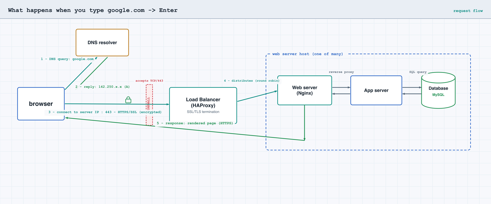

# What happens when you type `https://www.google.com` and press Enter

Holberton blog-post project. It traces a single request through the web stack —
DNS, TCP/IP, firewall, HTTPS/SSL, load balancer, web server, application server,
and database — as a published article plus a diagram.

| Task | File | Holds |
|------|------|-------|
| 0 — Blog post | `0-blog_post` | URL of the published blog post |
| 1 — Diagram | `1-what_happen_when_diagram` | URL of the diagram image |

The hostable page is `index.html` (rendered blog); the diagram is
`request-flow.png` (source `request-flow.svg`, generated by `make_diagram.py`).

---

## The blog post

> In an interview, first ask whether to focus on one area — a front-end role may
> want the DOM/render path, an SRE role may want the load-balancing mechanism.
> This post takes the **infrastructure** path.

### 1. DNS request — turning the name into an address

The browser needs the address behind `www.google.com`. It checks its caches
(browser, OS, `/etc/hosts`); on a miss it asks a **DNS resolver**, which walks
the DNS hierarchy (root → `.com` TLD → Google's authoritative name servers).
**DNS resolves `www.google.com` to another hostname** (via a `CNAME` record) **or
to an IP address** (via an `A`/`AAAA` record). The answer is cached for the
record's TTL.

### 2. TCP/IP — opening a connection

With the IP in hand, the browser opens a **TCP** connection to the **server IP on
port 443** (HTTPS). TCP's three-way handshake (`SYN → SYN-ACK → ACK`) sets up a
reliable, ordered byte stream, and the packets are routed across the internet by
**IP**.

### 3. Firewall — only the right traffic gets through

Before reaching the service, the connection passes through a **firewall that
accepts traffic on TCP port 443** and denies everything else. Any packet on a
disallowed port or from a blocked source is dropped here.

### 4. HTTPS/SSL — encrypting the channel

On top of TCP, a **TLS handshake** runs. The server presents its **SSL
certificate**, signed by a Certificate Authority the browser trusts; this proves
the server's identity and is used to negotiate a shared session key. From here,
**all traffic is encrypted using HTTPS/SSL** — confidentiality, integrity, and
authentication.

### 5. Load balancer — choosing a server

The public IP belongs to a **load balancer** (e.g. HAProxy), not a single
machine. The **load balancer distributes the request to one of its web servers**,
using a distribution algorithm such as round robin, after health-checking its
backends.

### 6. Web server — serving the page

The chosen **web server** (e.g. Nginx) **answers the request by serving the web
page**. It handles HTTP, serves static content directly, and reverse-proxies
dynamic requests to the application layer.

### 7. Application server — generating the page

For dynamic content, the **application server generates the web page** by running
the application code. The page does not exist until it is built for this request.

### 8. Database — gathering the data

To build the page, the **application server queries the database** (e.g. MySQL)
**to gather the necessary data**. The rows come back, the application finishes
building the page, and the response travels back — encrypted — through the web
server, load balancer, and firewall to the browser, which renders it.

---

## Coverage (matches the review rubric)

| Required point | Covered |
|----------------|---------|
| DNS resolves `www.google.com` to another hostname or IP | §1 |
| Request reaches the server IP on port HTTPS 443 | §2 |
| Traffic encrypted with an HTTPS/SSL certificate | §4 |
| Request passes a firewall that accepts TCP/443 | §3 |
| Request distributed by the load-balancer to a web server | §5 |
| Web server serves the page | §6 |
| Application server generates the page | §7 |
| Application server queries the database | §8 |
